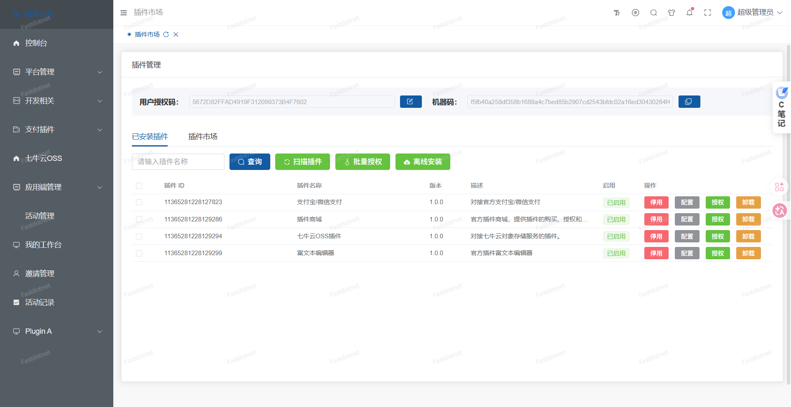

# Fastdotnet: AI Agent 时代的企业级动态插件化底座

**[🇨🇳 中文文档](README.md)** | **[🇺🇸 English Documentation](README.en.md)**

> 🏪 **插件商城现已上线！** 海量现成插件，助力外包项目快速交付，缩短周期 70%+ → [立即浏览](https://fastdotnet.top/marketplace)

## 🚀 为什么需要 Fastdotnet？

还在为复杂的业务模块解耦头疼吗？还在纠结如何实现不间断更新吗？

Fastdotnet 为你提供一套开箱即用的**动态插件加载方案**，基于 .NET 10 和 AssemblyLoadContext 技术，实现真正的运行时热插拔。它不仅是一个开发框架，更是 **AI Agent 应用实现模块化编排的高效底座**。

### 💡 核心价值：像搭积木一样构建企业应用

<div align="center">
  
  <p><em>可视化插件管理界面，支持在线购买、一键安装与热更新</em></p>
</div>

#### 🏪 插件商城生态
- **官方插件库**：支付、工作流、社交登录、对象存储等常用功能开箱即用
- **第三方开发者**：社区贡献的专业插件，覆盖各行业业务场景
- **快速项目交付**：外包项目通过插件组合，从“月”级别缩短到“周”级别交付
- **💰 开发者价值复用**：一次开发，多次销售 - 将通用功能封装为插件上架商城，实现从“项目制”到“产品化”的转变

### 解决什么问题？
- **企业 SaaS 多租户场景**：不同客户需要不同的功能模块，传统单体应用难以灵活配置
- **功能动态扩展需求**：业务快速迭代时，无需重启服务即可动态加载/卸载功能模块
- **团队协作与隔离**：多个团队独立开发功能模块，避免依赖冲突和相互影响
- **微服务轻量化替代**：提供类似微服务的模块化能力，但无需复杂的分布式基础设施
- **🚀 快速项目交付**：通过插件商城海量现成插件，外包项目可快速组装上线，缩短交付周期 70%+

### 与 ABP / Orchard Core 等框架的区别？

| 特性 | Fastdotnet | ABP Framework | Orchard Core |
|------|-----------|---------------|-------------|
| **插件隔离性** | ✅ AssemblyLoadContext 真正隔离，DLL版本互不冲突 |  共享同一应用域，存在依赖冲突风险 | ⚠️ 基于租户隔离，复杂度较高 |
| **热插拔能力** | ✅ 运行时动态加载/卸载，无需重启 | ⚠️ 需要重启应用才能加载新模块 | ✅ 支持模块化，但配置较繁琐 |
| **前端集成** | ✅ qiankun 微前端深度集成，前后端同步交付 | ❌ 需自行实现前端模块化方案 | ❌ 主要关注后端 CMS 能力 |
| **架构复杂度** |  轻量级分层架构，学习成本低 | 🔴 重度 DDD 架构，学习曲线陡峭 | 🟡 中等复杂度，适合 CMS 场景 |
| **AI 集成潜力** | 🚀 专为 AI Agent 编排设计，易于挂载智能体插件 | ⚠️ 需额外适配 | ❌ 无原生支持 |
| **适用场景** | 中小型企业应用、SaaS平台、快速原型开发、AI 应用底座 | 大型企业级复杂业务系统 | 内容管理系统 (CMS) |

---

##  3 分钟快速上手

无需复杂的环境配置，通过 Docker 即可在 1 分钟内体验完整的 Fastdotnet 生态。

### 方式一：Docker 一键启动（推荐）

```bash
# 克隆仓库
git clone https://github.com/CN-GodHei/fastdotnet.git
cd fastdotnet/docker

# 启动所有服务（后端 + 前端 + 数据库）
docker-compose up -d
```

启动完成后，访问以下地址：
- **管理端**：http://localhost:8080 (`superadmin` / `123456`)
- **应用端**：http://localhost:8081 (`admintest` / `123456`)

### 方式二：代码极简示例

如果你想直接在代码中体验插件加载，只需几行代码：

```csharp
var builder = WebApplication.CreateBuilder(args);
builder.Services.AddFastdotnet(); // 注册框架核心服务

var app = builder.Build();
app.UseFastdotnetPlugins(); // 自动扫描并加载 plugins 目录下的所有插件

app.Run();
```

> 💡 **提示**：更多关于插件开发的细节，请查看 [插件开发指南](https://docs.fastdotnet.top)。

---

## 💬 交流与支持

**👥 QQ交流群：[779454817](https://qm.qq.com/cgi-bin/qm/qr?k=779454817&jump_from=webapi)**

**🗣️ GitHub Discussions**：[点击参与](https://github.com/CN-GodHei/fastdotnet/discussions) - 公开问答、功能建议、插件交流（推荐）

> 点击链接即可加入QQ群，获取技术支持、交流开发经验、反馈问题建议

---

## 🌐 官方网站

- **官网**：[https://fastdotnet.top](https://fastdotnet.top) - 框架介绍、特性展示
- **🏪 插件商城**：[https://fastdotnet.top/marketplace](https://fastdotnet.top/marketplace) - 海量插件选购，快速组装项目
- **官方文档**：[https://docs.fastdotnet.top](https://docs.fastdotnet.top) - 完整开发文档

## 🎮 在线体验

无需安装，立即体验 Fastdotnet：

- **管理端演示**：http://admin.demo.fastdotnet.top/
  - 账号：`superadmin` / 密码：`123456`
  - 功能：系统管理、用户管理、权限配置等
  - 💡 提示：可使用 `mktest` / `123456` 体验插件商城的下载和授权功能

- **应用端演示**：http://app.demo.fastdotnet.top/
  - 账号：`admintest` / 密码：`123456`
  - 功能：业务操作、数据展示等

> 💡 提示：演示环境数据会定期重置，请勿存储重要数据。

## 🤝 赞助商

感谢以下赞助商对 Fastdotnet 项目的支持：

<div align="center">
  <a href="https://www.netzyun.com/" target="_blank">
    
  </a>
  <p><strong>网臻云</strong> - 我们的演示服务器赞助商</p>
</div>

---

##  AI 集成规划 (AI-Ready)

Fastdotnet 正在积极向 **AI Agent 时代** 演进。我们已完成了基于 Microsoft Semantic Kernel 的智能体集成方案规划，旨在让开发者能够像挂载插件一样轻松接入 AI 能力。

###  规划概览
- **智能对话与 RAG**：支持知识库问答、上下文记忆管理。
- **Agent 编排**：通过 Elsa 工作流引擎实现多智能体协作与任务自动化。
- **Function Calling**：插件即工具，AI 可直接调用业务逻辑。

👉 **查看详细规划**：[AI 智能体集成方案](backend/AI智能体集成方案/README.md)

---

##  社区规范与贡献引导

Fastdotnet 是一个开放的项目，我们欢迎任何形式的贡献。为了让协作更高效，请遵循以下规范：

###  Issue 模板
我们建立了标准化的 Issue 模板，请在反馈问题时选择对应的类型：
- [Bug Report](https://github.com/CN-GodHei/fastdotnet/issues/new?template=bug_report.yml)：报告程序错误或异常。
- [Feature Request](https://github.com/CN-GodHei/fastdotnet/issues/new?template=feature_request.yml)：提出新功能建议或改进想法。

###  Roadmap (开发路线图)

| 阶段 | 计划内容 | 状态 |
|------|----------|------|
| v1.0 | 核心插件系统、OIDC 认证、基础权限管理 | ✅ 已完成 |
| v1.1 | 插件商城上线、支付/工作流官方插件发布 | 🚀 进行中 |
| v1.2 | **AI Agent 集成**、智能体编排引擎 |  规划中 |
| v1.3 | 增强多租户隔离、性能优化与 AOT 支持 | ⏳ 待定 |

> 💡 **欢迎贡献**：如果你对某个功能感兴趣，欢迎在 Issues 中留言或直接提交 PR！

###  CONTRIBUTING.md
详细的贡献指南请参阅 [CONTRIBUTING.md](CONTRIBUTING.md)，其中包含了如何运行测试、代码风格规范以及 PR 提交流程。

---

##  安全测试合作招募

**我们正在寻找专业的网络安全公司合作！**

Fastdotnet 作为一个企业级开发框架，高度重视系统安全性。我们诚邀专业的安全测试团队对框架进行全面的安全审计和渗透测试。

### 合作内容
- ✅ 框架核心代码安全审计
- ✅ 插件系统隔离机制安全性验证
- ✅ 认证授权体系（OIDC/JWT/RBAC）安全测试
- ✅ API 接口安全防护评估
- ✅ 数据加密与传输安全检测
- ✅ 常见漏洞扫描（SQL注入、XSS、CSRF等）

### 合作方式
- **免费测试**：为安全公司提供免费的测试环境和技术支持
- **品牌曝光**：在 README、官网、文档中展示贵公司 Logo 和链接
- **报告发布**：公开发布测试报告，提升双方行业影响力
- **长期合作**：建立持续的安全合作机制

### 联系我们
📧 邮箱：yunnanzuyuankeji@163.com  
💬 QQ群：779454817

> 💡 如果您是安全领域的专业公司或团队，欢迎与我们联系，共同提升 Fastdotnet 的安全性！

---

## 📚 官方文档

访问 [https://docs.fastdotnet.top](https://docs.fastdotnet.top) 查看完整文档，包括：
- 快速开始指南
- 架构设计说明
- 后端开发教程
- 前端开发教程
- 插件开发指南
- API 参考文档

---

## 项目简介
Fastdotnet是一个基于**.NET 10**的模块化开发框架，采用插件化架构设计，支持功能模块的热插拔，具有高度的可扩展性和灵活性。框架底座采用分层架构设计，插件开发可以自由选择架构模式（如DDD、Clean Architecture等）。

### ✨ 核心功能

#### 📦 核心框架已实现功能清单

> 💡 **以下功能均已内置于框架底座，无需额外开发，开箱即用！**

##### 🔐 认证授权系统
- ✅ **OIDC/SSO 单点登录**：基于 OpenIddict，支持跨应用统一认证
- ✅ **JWT Token 认证**：标准的 JSON Web Token 机制
- ✅ **RBAC 权限管理**：基于角色的访问控制，支持按钮级权限
- ✅ **多租户隔离**：完善的租户数据隔离机制
- ✅ **验证码系统**：图形验证码、滑块验证等多种验证方式
- ✅ **黑名单管理**：IP 黑名单、用户黑名单
- ✅ **限流保护**：API 请求频率限制

##### 👥 用户管理系统
- ✅ **管理员管理**：完整的 CRUD + 角色分配
- ✅ **应用用户管理**：C 端用户管理，支持社交账号绑定
- ✅ **用户布局配置**：个性化界面布局保存
- ✅ **密码重置**：安全的密码找回和重置流程
- ✅ **用户待办任务**：任务分配、审批流程

##### 📋 系统管理功能
- ✅ **菜单管理**：动态菜单配置，支持多级嵌套
- ✅ **角色管理**：角色创建、权限分配
- ✅ **字典管理**：数据字典维护，支持树形结构
- ✅ **系统配置**：全局参数配置和管理
- ✅ **通知公告**：站内消息通知系统
- ✅ **工作台**：个性化工作台面版

##### 💾 数据存储与缓存
- ✅ **SqlSugar ORM**：高性能 ORM，支持 CodeFirst/DbFirst
- ✅ **多数据库支持**：SQLite、MySQL、PostgreSQL、SQL Server、达梦
- ✅ **混合缓存系统**：本地内存 + Redis 双层缓存架构
- ✅ **仓储模式**：标准化的数据访问抽象层
- ✅ **事务管理**：完整的事务支持

##### 🎨 前端基础能力
- ✅ **Vue 3 + TypeScript**：现代化前端技术栈
- ✅ **Element Plus UI**：企业级组件库集成
- ✅ **qiankun 微前端**：子应用动态加载和独立部署
- ✅ **动态路由生成**：根据后端配置自动生成前端路由
- ✅ **响应式布局**：完美支持桌面端和移动端
- ✅ **主题切换**：明暗主题、自定义主题色
- ✅ **国际化支持**：多语言切换（i18n）
- ✅ **标签页管理**：多标签页浏览、KeepAlive 缓存

##### 🔌 插件系统核心
- ✅ **AssemblyLoadContext 隔离**：真正的插件运行时隔离
- ✅ **动态热插拔**：运行时加载/卸载，无需重启
- ✅ **插件生命周期管理**：初始化、启动、停止、卸载
- ✅ **独立依赖上下文**：每个插件独立的 DLL 版本管理
- ✅ **插件间 EventBus**：低耦合的跨插件通信 → [详细文档](docs/05-插件开发/事件总线.md)
- ✅ **插件分支网关**：插件私有请求处理管道
- ✅ **反向代理逃生舱**：支持插件自带 Web 服务器
- ✅ **静态资源映射**：自动处理插件 wwwroot 文件
- ✅ **容器化 DI**：基于 Autofac 的独立 LifetimeScope
- ✅ **文件系统监控**：自动检测插件变更

##### 🛡️ 安全与防护
- ✅ **敏感数据脱敏**：自动识别和脱敏敏感信息
- ✅ **防重放攻击**：请求重放检测和保护
- ✅ **加密传输**：请求/响应 AES+RSA 加密
- ✅ **全局异常处理**：统一的异常捕获和日志记录
- ✅ **业务操作日志**：完整的操作审计追踪
- ✅ **Graceful Shutdown**：优雅停机机制

##### 📡 实时通信
- ✅ **SignalR Hub**：WebSocket 实时通信支持
- ✅ **通用 Hub**：UniversalHub 支持多种消息类型
- ✅ **插件 SignalR**：插件级别的实时通信端点
- ✅ **连接状态管理**：自动重连、状态监控
- ✅ **框架对外推送**：基于 Outbox 模式的可靠事件推送，支持 SignalR 实时推送和 Webhook 回调 → [详细文档](docs/05-插件开发/对外推送.md)

##### 🔧 开发辅助工具
- ✅ **Swagger/OpenAPI**：自动生成的 API 文档
- ✅ **代码生成器**：一键生成 CRUD 代码
- ✅ **插件 CLI 工具**：快速创建插件模板
- ✅ **热重载支持**：开发时自动检测代码变更
- ✅ **统一响应格式**：标准化的 API 响应结构
- ✅ **模型验证**：自动的参数验证和错误提示

##### 🚀 性能优化
- ✅ **HybridCache**：本地 + 分布式双层缓存
- ✅ **缓存特性标注**：@CacheResult 装饰器简化缓存使用
- ✅ **批量操作优化**：支持批量更新、删除等操作
- ✅ **分页查询**：高效的分页数据查询

#### 🏪 插件商城生态系统（⭐ 核心优势）

> 💡 **框架内置基础能力 + 插件商城扩展功能 = 完整的企业级解决方案**

| 类别 | 框架内置（✅ 已实现） | 插件商城（🔌 可扩展） |
|------|---------------------|---------------------|
| **认证授权** | OIDC/SSO、JWT、RBAC、多租户 | 社交登录（微信/QQ/钉钉）、LDAP集成 |
| **用户管理** | 管理员、应用用户、角色权限 | 会员等级、积分系统、实名认证 |
| **数据存储** | SqlSugar ORM、多数据库、缓存 | 数据同步、ETL工具、数据备份 |
| **支付系统** | - | 支付宝、微信支付、银联支付 |
| **工作流** | 待办任务、审批流程 | Elsa工作流引擎、可视化设计器 |
| **对象存储** | - | 阿里云OSS、腾讯云COS、MinIO、AWS S3 |
| **消息通知** | 站内信 | 邮件、短信、企业微信、钉钉机器人 |
| **富文本** | - | TinyMCE、Quill、WangEditor等编辑器 |
| **报表系统** | - | 数据报表、图表分析、打印模板 |
| **行业插件** | - | CRM、ERP、OA、电商、教育等行业方案 |

- **官方精选插件**：支付系统、工作流引擎、社交登录、对象存储等常用功能，开箱即用
- **第三方开发者生态**：社区贡献的专业插件，覆盖电商、CRM、ERP、OA 等行业场景
- **快速项目交付**：外包项目通过插件组合，从“月”级别缩短到“周”级别交付，效率提升 70%+
- **💰 开发者价值复用**：一次开发，多次销售 - 将项目中提炼的通用功能封装为插件，上架商城实现持续收益
- **从项目制到产品化**：摆脱“做一个项目写一遍代码”的困境，打造可复用的产品资产
- **一键安装部署**：可视化的插件管理界面，支持在线购买、自动下载、一键安装
- **版本管理与更新**：完善的插件版本控制，支持平滑升级和回滚

#### 🔌 插件系统
- **真正的运行时热插拔**：基于 AssemblyLoadContext 实现插件隔离，支持动态加载/卸载
- **独立依赖管理**：每个插件拥有独立的依赖上下文，彻底解决 DLL 版本冲突
- **微前端集成**：后端插件与 qiankun 微前端无缝对接，实现前后端同步交付
- **插件间通信**：内置 EventBus 事件总线，支持低耦合的跨插件联动
- **灵活路由机制**：支持插件分支网关、反向代理逃生舱、静态资源自动映射

#### 🔐 认证授权
- **OIDC/SSO 支持**：基于 OpenIddict 实现开放身份连接协议，支持单点登录
- **JWT 认证**：标准的 JSON Web Token 认证机制
- **细粒度权限控制**：基于角色的访问控制（RBAC），支持按钮级权限
- **多租户支持**：完善的租户隔离机制

#### 💾 数据访问
- **SqlSugar ORM**：高性能 ORM 框架，支持 CodeFirst/DbFirst
- **多数据库适配**：SQLite、MySQL、PostgreSQL、SQL Server、达梦等
- **混合缓存系统**：本地内存 + 分布式缓存（Redis）双层架构
- **仓储模式**：标准化的数据访问抽象层

#### 🎨 前端架构
- **Vue 3 + TypeScript**：现代化前端技术栈
- **Element Plus UI**：企业级组件库
- **qiankun 微前端**：支持子应用动态加载和独立部署
- **动态路由**：根据后端配置自动生成前端路由
- **响应式设计**：完美支持桌面端和移动端

#### 🛠️ 开发体验
- **代码生成器**：一键生成 CRUD 代码，提升开发效率
- **Swagger/OpenAPI**：自动生成的 API 文档
- **插件 CLI 工具**：快速创建插件模板
- **热重载支持**：开发时自动检测代码变更

#### 📊 业务功能
- **工作流引擎**：集成 Elsa Workflow，支持可视化流程设计
- **支付系统**：支付宝、微信支付等多渠道支付支持
- **社交登录**：微信、QQ、钉钉等第三方登录
- **对象存储**：阿里云 OSS、腾讯云 COS、MinIO、AWS S3 等
- **富文本编辑器**：集成多种富文本编辑方案
- **消息通知**：站内信、邮件、短信等多渠道通知

### 核心技术栈

**后端：**
- 🚀 **.NET 10** - 最新版本的 .NET 运行时
- 🗄️ **SqlSugar ORM** - 高性能 ORM 框架
- 🔐 **OpenIddict / OIDC** - 开放身份连接协议，支持 SSO
- 🔑 **JWT** - JSON Web Token 认证
- 💉 **Autofac** - 依赖注入容器
- 📝 **Swagger/OpenAPI** - API 文档

**前端：**
- ⚡ **Vue 3 + TypeScript** - 现代化前端框架
- 🎨 **Element Plus** - 企业级 UI 组件库
- 🏗️ **Vite** - 极速构建工具
- 🔌 **qiankun** - 微前端框架

## 项目结构
```
├── backend/
│   ├── Fastdotnet.Core/           # 核心领域层
│   │   ├── Attributes/            # 特性定义
│   │   ├── Constants/             # 常量定义
│   │   ├── Controllers/           # 控制器基类
│   │   ├── Dtos/                  # 数据传输对象
│   │   ├── Entities/              # 实体模型
│   │   ├── Enum/                  # 枚举定义
│   │   ├── Exceptions/            # 异常处理
│   │   ├── Extensions/            # 扩展方法
│   │   ├── Hubs/                  # SignalR Hub
│   │   ├── IService/              # 服务接口
│   │   ├── Middleware/            # 中间件
│   │   ├── Plugin/                # 插件系统核心接口
│   │   ├── Service/               # 服务实现
│   │   ├── Settings/              # 配置设置
│   │   ├── Utils/                 # 工具类
│   │   └── Version/               # 版本信息
│   ├── Fastdotnet.Orm/            # ORM数据访问层
│   ├── Fastdotnet.Plugin.Contracts/ # 插件契约层
│   ├── Fastdotnet.Plugin.Shared/  # 插件共享组件
│   ├── Fastdotnet.Service/        # 应用服务层
│   │   ├── IService/              # 服务接口
│   │   └── Service/               # 服务实现
│   ├── Fastdotnet.WebApi/         # Web API层
│   │   ├── Controllers/           # API控制器
│   │   ├── Middleware/            # 中间件
│   │   └── plugins/               # 插件部署目录
│   └── Plugins/                   # 插件源码目录
│       ├── PluginA/               # 示例插件
│       └── README.md              # 插件系统说明
├── Web/                           # 前端项目
│   ├── fastdotnet-admin/          # 管理后台前端
│   ├── fastdotnet-app/            # 应用前端
│   └── plugin-a-admin/            # 插件A管理前端
```

## 架构说明

### 分层架构
1. **Fastdotnet.Core**
   - 框架核心基础层，提供通用的基础设施与底层支持
   - 定义系统级的常量、枚举、异常处理及工具类
   - 承载插件系统的核心契约（Contracts）与扩展点接口
   - 保持零外部依赖，确保整个框架的稳定性和纯净度

2. **Fastdotnet.Orm**
   - 数据访问基础设施层，基于 SqlSugar 封装
   - 提供通用的仓储模式（Repository）与数据库连接管理
   - 支持多数据库适配（SQLite、MySQL、PostgreSQL、达梦等）

3. **Fastdotnet.Plugin.Contracts**
   - 插件通信契约层，定义主程序与插件交互的标准接口
   - 包含插件生命周期（IPlugin）、权限扩展及存储上下文等核心定义
   - 作为插件开发的唯一依赖项，确保插件与底座的松耦合

4. **Fastdotnet.Plugin.Shared**
   - 插件运行时共享组件，提供 AOT 适配器与通用工具
   - 协助插件在独立上下文中安全地访问系统资源

5. **Fastdotnet.Service**
   - 业务逻辑实现层，承载底座的核心功能模块
   - 封装用户管理、权限控制、系统配置等通用业务服务
   - 协调 ORM 数据操作与上层 API 请求

6. **Fastdotnet.WebApi**
   - 宿主启动层，负责应用程序的组装与运行
   - 集成认证授权、全局中间件、Swagger 及插件加载引擎
   - 提供统一的 HTTP 入口点与动态路由分发能力

### 依赖关系
- Fastdotnet.Core: 不依赖其他项目
- Fastdotnet.Orm: 依赖 Core
- Fastdotnet.Plugin.Contracts: 依赖 Core
- Fastdotnet.Plugin.Shared: 依赖 Contracts
- Fastdotnet.Service: 依赖 Core, Orm
- Fastdotnet.WebApi: 依赖 Core, Orm, Plugin.Contracts, Plugin.Shared, Service

## 插件系统

### 📊 架构可视化

我们使用 [Graphify](https://github.com/graphify-dev/graphify) 生成了完整的代码知识图谱，帮助您更好地理解系统架构：

- **交互式图谱**：查看 [graph.html](graphify-out/graph.html) - 可缩放、可搜索的完整关系图
- **树状结构**：查看 [GRAPH_TREE.html](graphify-out/GRAPH_TREE.html) - 层次化的模块组织视图
- **详细报告**：查看 [GRAPH_REPORT.md](graphify-out/GRAPH_REPORT.md) - 包含社区分析、核心节点统计等

> 💡 提示：知识图谱展示了 4349 个节点和 10146 条关系边，分为 294 个功能社区，是理解项目结构的最佳工具。

### 核心优势
Fastdotnet 的插件化架构专为高扩展性、动态性和企业级 SaaS 场景设计，具备以下显著优势：

1. **强隔离性 (Strong Isolation)**
   - 采用 `AssemblyLoadContext` (ALC) 技术，为每个插件创建独立的运行上下文。
   - 彻底解决 DLL 版本冲突问题，不同插件可以使用同一库的不同版本而互不干扰。
   - 插件崩溃不会影响主程序的稳定性，实现了真正的故障隔离。

2. **动态热插拔 (Dynamic Hot-Swapping)**
   - 支持在运行时动态加载、启动、停止和卸载插件，无需重启服务器。
   - 配合文件系统监控（FileSystemWatcher），可实现插件文件的自动检测与热更新。
   - 插件状态实时更新，支持优雅停机（Graceful Shutdown）和资源清理。

3. **微前端深度集成 (Micro-Frontends Integration)**
   - 后端插件与前端 qiankun 微应用无缝对接。
   - 主前端根据后端返回的元数据，动态加载远程插件的 Vue/React 子应用。
   - 实现了前后端功能模块的完全解耦与同步交付。

4. **灵活的网关与路由 (Flexible Gateway & Routing)**
   - **插件分支网关**：允许插件注册私有的请求处理管道，实现类似“子应用”的独立逻辑。
   - **反向代理逃生舱**：支持插件自带微型 Web 服务器（如 Kestrel），主程序通过 YARP 进行透明转发，兼容异构技术栈。
   - **静态资源映射**：自动处理插件 `wwwroot` 下的文件服务，完美支持 SPA 应用的 History 模式。

5. **容器化依赖注入 (Scoped DI Container)**
   - 基于 Autofac 为每个插件分配独立的 `LifetimeScope`。
   - 插件内部的服务注册高度自治，同时可通过接口与主程序或其他插件安全交互。
   - 避免了全局容器的污染，提升了系统的可维护性。

6. **事件驱动通信 (Event-Driven Communication)**
   - 内置强大的 `IEventBus`，支持跨插件的发布/订阅模式。
   - 插件间通过事件进行低耦合联动，便于构建复杂的业务流转体系。

### 技术栈
插件系统基于以下核心技术构建：

- .NET Core 动态加载机制（AssemblyLoadContext）
- 依赖注入（Microsoft.Extensions.DependencyInjection和Autofac）
- ASP.NET Core MVC（用于插件控制器的注册和路由）
- 文件系统监控（FileSystemWatcher，用于热加载）
- 反射（用于类型发现和服务注册）

### 插件目录结构
```
backend/Plugins/
├── PluginA/                # 插件A项目
│   ├── Controllers/        # 控制器
│   ├── IService/           # 服务接口
│   ├── Services/           # 服务实现
│   ├── PluginA.cs          # 插件主类
│   ├── PluginA.csproj      # 项目文件
│   └── plugin.json         # 插件配置文件
└── README.md               # 插件系统说明
```

### 插件接口
每个插件必须实现`IPlugin`接口，该接口定义了插件的基本生命周期方法：

```csharp
public interface IPlugin
{
    string PluginId { get; }     // 插件唯一标识符
    string Name { get; }         // 插件名称
    string Version { get; }      // 插件版本
    PluginLifecycleState LifecycleState { get; } // 插件生命周期状态
    
    Task InitializeAsync(IServiceProvider serviceProvider); // 插件初始化
    Task StartAsync();          // 插件启动
    Task StopAsync();           // 插件停止
    Task UnloadAsync(IServiceProvider serviceProvider); // 插件卸载前清理
    void ConfigureServices(ContainerBuilder builder); // 配置插件服务
}
```

### 插件配置文件
每个插件需要包含一个`plugin.json`配置文件，用于描述插件的基本信息：

```json
{
  "id": "PluginA",
  "name": "Fastdotnet Demo Plugin",
  "description": "演示插件，用于展示插件系统的基本功能",
  "version": "1.0.0",
  "enabled": true,
  "author": "Fastdotnet Team",
  "dependencies": [],
  "tags": ["demo", "example"]
}
```

### 插件开发规范
1. 插件项目命名规范：建议使用有意义的名称
2. 每个插件需要实现`IPlugin`接口或继承`PluginBase`基类（推荐）
   - `PluginBase`提供了默认的生命周期状态管理，简化插件开发
   - 继承`PluginBase`后只需重写`OnInitializeAsync`、`OnStartAsync`等钩子方法
3. 插件必须在.csproj文件中配置唯一的`<PluginId>`属性
4. 插件之间应保持独立，避免相互依赖
5. 插件可以包含自己的控制器、服务和模型
6. 插件控制器应继承自`GenericDtoControllerBase`或`AppGenericDtoControllerBase`基类

### 🚀 快速开始：Hello World 插件

为了帮助您快速理解如何挂载功能，这里提供一个最简化的插件示例：

```csharp
public class HelloWorldPlugin : PluginBase
{
    public override string PluginId => "hello-world";
    public override string Name => "Hello World Plugin";
    public override string Version => "1.0.0";
    
    // 1. 注册服务：这是解决“第一个阻碍”的关键
    public override void ConfigureServices(ContainerBuilder builder)
    {
        // 在这里注册您的服务，它们将拥有独立的 DI 容器
        builder.RegisterType<MyService>().As<IMyService>().InstancePerLifetimeScope();
    }
    
    protected override Task OnStartAsync()
    {
        Console.WriteLine("Hello World Plugin is running!");
        return Task.CompletedTask;
    }
}
```

> 💡 **提示**：通过 `ContainerBuilder` 注册的服务会自动与主程序隔离，您无需担心 DLL 版本冲突问题。

### 热插拔机制
- 插件管理器负责插件的加载、卸载和生命周期管理
- 支持运行时动态加载和卸载插件
- 文件系统监控自动检测插件变更
- 插件状态实时更新，支持优雅停止

## 缓存系统

### 技术栈
缓存系统基于Microsoft HybridCache构建，具有以下特点：

- **双层缓存架构**：本地内存缓存 + 分布式缓存（Redis/MemoryCache）
- **高性能**：本地缓存提供最快的访问速度
- **高可用**：分布式缓存确保多实例间的数据一致性
- **灵活配置**：支持MemoryCache和Redis两种后端存储

### 核心组件
1. **IHybridCacheService** - 核心缓存服务接口
2. **CacheResultAttribute** - 控制器方法缓存特性
3. **CacheTagAttribute** - 缓存标签特性

### 使用方式

#### 控制器层使用
```csharp
[ApiController]
[Route("api/[controller]")]
public class UserController : ControllerBase
{
    [HttpGet("{id}")]
    [CacheResult(ExpirationSeconds = 600)]
    [CacheTag("user")]
    public async Task<ActionResult<UserDto>> GetUser(int id)
    {
        // 实际业务逻辑
    }
}
```

#### 服务层使用
```csharp
public class UserService : IUserService
{
    private readonly IHybridCacheService _cacheService;
    
    public async Task<UserDto> GetUserAsync(int userId)
    {
        var key = $"user:{userId}";
        return await _cacheService.GetOrCreateAsync(key, async () =>
        {
            // 从数据库获取数据
        });
    }
}
```

### 安全性说明
缓存机制与JWT认证完全兼容，认证检查始终在缓存检查之前执行，确保安全性。

更多详细信息请参阅 [缓存使用指南](docs/HybridCache使用指南.md)

## 设计原则
1. **依赖倒置原则(DIP)**
   - 高层模块不应依赖低层模块，两者都应依赖抽象
   - 抽象不应依赖细节，细节应依赖抽象

2. **单一职责原则(SRP)**
   - 每个类都应该有一个单一的职责
   - 每个模块的功能要高内聚，低耦合

3. **开放封闭原则(OCP)**
   - 对扩展开放，对修改关闭
   - 通过插件系统支持功能扩展

4. **接口隔离原则(ISP)**
   - 客户端不应依赖它不需要的接口
   - 接口应该小而精确

## 快速开始

### 🏪 方式一：通过插件商城快速组装（推荐）

适合外包项目、快速原型开发，无需从零编码：

#### 📋 功能需求对照表

**您的项目需要什么功能？**

| 功能需求 | 框架内置 | 需要插件 |
|---------|---------|----------|
| 用户登录、权限管理 | ✅ 已内置 | - |
| 菜单、角色、字典管理 | ✅ 已内置 | - |
| 多租户数据隔离 | ✅ 已内置 | - |
| API文档、代码生成 | ✅ 已内置 | - |
| 微信/支付宝支付 | - | 🔌 支付插件 |
| 工作流审批 | 基础待办 | 🔌 Elsa工作流插件 |
| 社交账号登录 | - | 🔌 社交登录插件 |
| 文件上传存储 | - | 🔌 OSS插件（阿里云/腾讯云等） |
| 邮件/短信通知 | 站内信 | 🔌 消息通知插件 |
| 富文本编辑 | - | 🔌 富文本插件 |
| 数据报表 | - | 🔌 报表插件 |

**步骤：**
1. **访问插件商城**：[https://fastdotnet.top/marketplace](https://fastdotnet.top/marketplace)
2. **浏览/搜索插件**：根据上表选择所需功能插件
   - 💼 支付系统：支付宝、微信支付集成
   - 📊 工作流引擎：可视化流程设计
   - 🔐 社交登录：微信、QQ、钉钉等
   - ☁️ 对象存储：阿里云 OSS、腾讯云 COS 等
3. **一键安装**：在管理后台直接购买并安装插件
4. **配置使用**：根据插件文档进行简单配置即可使用
5. **快速交付**：组合多个插件，快速完成项目交付

> 💡 **案例**：某外包公司使用 Fastdotnet + 插件商城，将原本需要 2 个月的 CRM 项目缩短至 2 周交付！

> 💰 **开发者机会**：您也可以在项目中提炼通用功能，封装为插件上架商城，实现“一次开发，多次销售”的价值复用！

> ✨ **框架完整性说明**：Fastdotnet 不是一个“空壳”框架，而是已经内置了完整的企业级应用基础能力（认证、权限、用户管理、系统管理等），您可以直接基于这些功能快速开发业务逻辑。对于额外的行业特定功能，再通过插件商城扩展。

### 环境要求
- .NET 10.0 SDK 或更高版本
- 支持的操作系统：Windows、Linux、macOS

### 构建项目
```bash
# 克隆仓库
git clone https://github.com/yourusername/fastdotnet.git
cd fastdotnet/backend

# 构建解决方案
dotnet build

# 运行WebApi项目
cd Fastdotnet.WebApi
dotnet run
```

### 开发插件
1. 在`backend/Plugins`目录下创建新的插件项目
2. 实现`IPlugin`接口或继承`PluginBase`基类（推荐），并在.csproj中配置`<PluginId>`
3. 构建插件并将输出复制到`backend/Fastdotnet.WebApi/plugins`目录

#### 💰 插件开发与上架 - 实现价值复用

**传统开发模式 vs Fastdotnet 插件模式：**

| 维度 | 传统项目制 | Fastdotnet 插件模式 |
|------|----------|-------------------|
| **代码复用** | ❌ 每个项目重新开发 | ✅ 一次开发，多次复用 |
| **收益模式** | 💸 一次性项目收入 | 💰 持续的销售分成 |
| **资产积累** | 📉 代码随项目结束而闲置 | 📈 插件成为可增值的产品资产 |
| **市场覆盖** | 🎯 单一客户 | 🌍 面向全平台用户 |
| **维护成本** | 🔧 多个项目分别维护 | ⚡ 统一版本，集中维护 |

**上架流程：**
1. **开发插件**：从项目中提炼通用功能，按照规范开发插件
2. **测试验证**：在本地环境充分测试插件功能和兼容性
3. **提交审核**：将插件提交到官方商城进行质量和安全审核
4. **上架销售**：审核通过后即可上架，自主设置价格和授权模式
5. **持续收益**：每次销售都能获得分成，实现“睡后收入”
6. **迭代优化**：根据用户反馈持续优化，提升销量和口碑

👉 **成功案例**：某开发者将项目中的“微信登录”功能封装为插件，上架后累计销售 500+ 份，实现被动收入超过 10 万元！

👉 详细指南：[插件开发文档](https://docs.fastdotnet.top) | [商城入驻指南](https://fastdotnet.top/marketplace/seller)

#### 示例：继承 PluginBase 基类
```csharp
public class MyPlugin : PluginBase
{
    public override string PluginId => "your-plugin-id";
    public override string Name => "My Plugin";
    public override string Version => "1.0.0";
    
    protected override Task OnInitializeAsync(IServiceProvider serviceProvider)
    {
        // 初始化逻辑
        return Task.CompletedTask;
    }
    
    protected override Task OnStartAsync()
    {
        // 启动逻辑
        return Task.CompletedTask;
    }
    
    public override void ConfigureServices(ContainerBuilder builder)
    {
        // 注册服务
    }
}
```

### 前端开发
项目包含多个前端应用：
- `Web/fastdotnet-admin/`: 管理后台前端应用
- `Web/fastdotnet-app/`: 用户应用前端
- `Web/plugin-a-admin/`: 插件A的管理前端

## 贡献指南
欢迎贡献代码、报告问题或提出改进建议。请遵循以下步骤：

1. Fork 项目
2. 创建特性分支 (`git checkout -b feature/amazing-feature`)
3. 提交更改 (`git commit -m 'Add some amazing feature'`)
4. 推送到分支 (`git push origin feature/amazing-feature`)
5. 创建 Pull Request

在参与贡献之前，请阅读：
- 📜 [行为准则](CODE_OF_CONDUCT.md) - 了解我们的社区规范和期望
- 🔒 [安全政策](SECURITY.md) - 如何负责任地报告安全漏洞

## 相关链接

- 🌐 **官方网站**：[https://fastdotnet.top](https://fastdotnet.top)
- 🏪 **🔥 插件商城**：[https://fastdotnet.top/marketplace](https://fastdotnet.top/marketplace) - 海量插件选购，快速组装项目
  - 💼 **官方插件**：支付、工作流、社交登录、OSS等常用功能
  - 👨‍💻 **第三方插件**：社区开发者贡献的专业插件
  - 🚀 **快速交付**：外包项目通过插件组合，缩短交付周期 70%+
  - 💰 **开发者价值复用**：一次开发，多次销售，将"项目代码"转化为"产品资产"
- 📚 **官方文档**：[https://docs.fastdotnet.top](https://docs.fastdotnet.top)
- 🎮 **在线演示**：
  - 管理端：http://admin.demo.fastdotnet.top/ (`superadmin` / `123456`，也可用 `mktest` / `123456` 体验插件功能)
  - 应用端：http://app.demo.fastdotnet.top/ (`admintest` / `123456`)
- 📦 **依赖清单**：
  - [后端依赖](DEPENDENCIES_BACKEND.md) - 查看后端使用的第三方库及许可证
  - [前端依赖](DEPENDENCIES_FRONTEND.md) - 查看前端使用的第三方库及许可证
- 🐛 **问题反馈**：[GitHub Issues](https://github.com/CN-GodHei/fastdotnet/issues)
- 📧 **官方邮箱**：yunnanzuyuankeji@163.com
- 💬 **QQ交流群**：779454817

---

## 联系方式

- 📧 **官方邮箱**：yunnanzuyuankeji@163.com
- 💬 **QQ交流群**：779454817

## 许可证
本项目采用 MIT 许可证 - 详情请参阅 LICENSE 文件

---

## 🏆 为什么选择 Fastdotnet？

### 适合您的场景吗？

✅ **如果您是：**
- SaaS 平台开发者，需要为不同客户提供定制化功能
- 企业内部系统开发团队，需要模块化协作开发
- **外包公司/独立开发者**：需要快速交付项目，降低开发成本
- 初创公司，需要快速迭代和灵活扩展
- 希望在不重启服务的情况下动态更新功能
- **💰 技术创业者/开发者**：希望通过插件商城实现价值复用，将“项目代码”转化为“产品资产”，获得持续收益

✅ **您将获得：**
- 🚀 **开发效率提升 50%+**：代码生成器 + 插件模板 + 完善的文档
- 🔧 **维护成本降低 60%**：真正的模块隔离，问题定位更简单
- 💰 **基础设施成本节省**：单体架构的性能，微服务的灵活性
- 🎯 **业务响应速度提升**：新功能上线从“天”级别缩短到“小时”级别
- 🏪 **项目交付周期缩短 70%**：通过插件商城现成功能组合，快速组装上线
- 💵 **开发者价值复用**：一次开发，多次销售，将“项目代码”转化为“产品资产”，获得持续被动收入

### 技术亮点总结

1. **真正的热插拔**：不是简单的模块加载，而是基于 AssemblyLoadContext 的真正隔离
2. **前后端一体化**：后端插件自动对接前端微应用，无需手动配置
3. **轻量级架构**：没有强制的 DDD 规范，插件内可自由选择架构模式
4. **企业级特性**：OIDC/SSO、多租户、工作流、支付系统等开箱即用
5. **活跃的社区**：QQ群 779454817，持续更新和维护
6. **🏪 插件商城生态**：官方+第三方插件库，快速组装项目
7. **💰 开发者价值复用**：一次开发，多次销售，从“项目制”到“产品化”，实现持续收益

### 对比其他框架

| 场景 | 推荐方案 |
|------|----------|
| 大型企业复杂业务，团队规模 100+ | ABP Framework |
| **中小型企业、SaaS平台、快速迭代** | **Fastdotnet** ⭐ |
| 简单的 CRUD 应用 | ASP.NET Core Minimal API |
| 超大规模分布式系统 | 微服务架构 |

---

## 💰 开发者价值复用 - 从“项目制”到“产品化”

### 传统开发模式的痛点

😩 **“做一个项目，写一遍代码”**
- 每个项目都要重新开发相似的功能（登录、支付、权限等）
- 代码无法复用，重复劳动，效率低下
- 项目结束后代码闲置，无法产生持续价值
- 收入依赖新项目，缺乏被动收入来源

### Fastdotnet 插件模式的优势

✨ **“一次开发，多次销售”**

```
项目开发过程中
    ↓
提炼通用功能模块
    ↓
封装为 Fastdotnet 插件
    ↓
上架插件商城
    ↓
持续销售 + 获得分成 💰💰💰
```

#### 实际案例

**案例 1：微信登录插件**
- 开发者A在项目中实现了微信登录功能
- 将其封装为插件，上架商城售价 ¥199
- 累计销售 500+ 份，总收入超过 ¥100,000
- 后续维护成本低，几乎纯利润

**案例 2：数据导出插件**
- 开发者B开发了通用的 Excel/PDF 导出功能
- 支持多种格式和自定义模板
- 上架后成为热门插件，月均销售 30+ 份
- 实现稳定的被动收入

**案例 3：行业解决方案插件包**
- 某团队将 CRM 系统的核心功能拆分为多个插件
- 包括：客户管理、订单处理、数据分析等
- 组合销售，客单价提升至 ¥2000+
- 同时提供定制服务，形成多元化收入

#### 如何开始？

1. **识别通用功能**：在项目中寻找可复用的功能模块
   - 认证授权、支付集成、消息通知
   - 数据导入导出、报表生成
   - 第三方 API 集成（微信、支付宝、钉钉等）

2. **封装为插件**：按照 Fastdotnet 插件规范进行开发
   - 参考官方文档和示例插件
   - 确保良好的兼容性和稳定性

3. **上架销售**：提交到插件商城审核
   - 编写清晰的说明文档
   - 设置合理的价格和授权模式

4. **持续优化**：根据用户反馈迭代升级
   - 修复 bug，增加新功能
   - 提升用户体验，积累好评

👉 **立即开始**：[插件开发指南](https://docs.fastdotnet.top/05-%E6%8F%92%E4%BB%B6%E5%BC%80%E5%8F%91/%E5%88%9B%E5%BB%BA%E6%8F%92%E4%BB%B6.html) | [商城入驻](https://fastdotnet.top/account/badges)

---

**🌟 如果 Fastdotnet 帮助到了您，欢迎 Star 支持！**