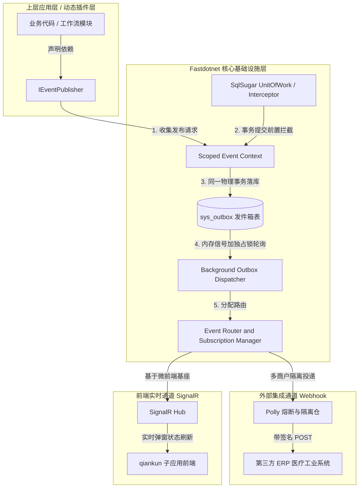

# Fastdotnet 基础设施：底层事件推送系统设计文档

## 1. 定位与哲学

`Fastdotnet.Core.Notification` 是 Fastdotnet 框架不可分割的**核心基础设施组件（Core Infrastructure）**。它不是一个可选的业务插件，而是作为框架底层的“事件驱动内核”，为上层所有的官方模块（如工作流引擎、组织架构、单据模块）及用户自定义动态加载的插件模块，提供标准的、内建的异步事件发布与可靠投递能力。

### 1.1 设计哲学

- **无感集成（Zero Friction）**：应用层开发和插件开发无需引用任何第三方消息队列中间件（如 RabbitMQ / Kafka），仅依赖框架核心抽象，通过极其简单的标准 API 即可获得企业级投递保障。
- **高內聚低耦合**：底层引擎完全通过 .NET 10 原生技术栈实现（SqlSugar + System.Threading.Channels），保证框架的轻量化与私有化独立部署的便利性，降低交付团队的整体部署心智。
- **租户原生（Tenant-Aware）**：推送管道天然与 Fastdotnet 的多租户上下文隔离机制（SaaS 内核）融为一体，支持按租户分库、分表或共享表的数据隔离。
- **二次授权合规**：内建生命周期钩子与审计能力，原生支持交付团队（Deliverer）对最终端客户的接口进行细粒度控制、流控与安全审计。

### 1.2 架构全景




## 2. 底层核心机制设计

### 2.1 基于工作单元的“延迟持久化”机制

为了防止业务失败但消息发出的分布式不一致问题（即业务回滚但通知已发出的诡异现象），基础设施引入了基于生命周期（Scoped）的事件延迟收集机制。

1. **收集期**：在一个 HTTP 请求或一个工作单元生命周期内，调用 `_eventPublisher.PublishAsync` 并不直接操作数据库，而是将事件对象存入当前 Scope 的内存列表。
2. **拦截期**：框架拦截器在感知到 SqlSugar 开启的事务准备 `Commit` 时，自动提取事件列表，将其转化为 `SysOutbox` 实体，并合并进当前的 `DbContext / SqlSugarClient` 事务中一并提交。
3. **保证**：100% 保证本地业务数据和 Outbox 数据在同一个数据库事务内，要么同时成功，要么同时回滚。

### 2.2 内存唤醒与独占抢占锁（保证分布式多实例高可用）

当 Fastdotnet 框架被交付团队以多节点（集群）方式部署时，后台投递服务 `OutboxProcessor` 必须防止多节点重复抓取同一条消息。

1. **双驱动唤醒**：
   - **内存信号驱动（主）**：本地事务成功提交后，基础设施通过 `System.Threading.Channels` 发送一个内存信号（仅包含 Event ID），后台消费线程立即感知并抢占处理，实现毫秒级响应，极大减轻数据库压力。
   - **定时轮询驱动（辅）**：常驻托管服务后台默认每 5 秒轮询一次数据库，作为内存信号丢失（如重启、断电）或失败重试的兜底。
2. **原子抢占锁**：
   基础设施利用 SqlSugar 的乐观锁机制，在内存轮询中执行**原子抢占更新**，确保单条消息只会被一个节点消费：
   ```csharp
   // 核心后台投递线程抢占逻辑
   var currentInstanceId = Guid.NewGuid(); // 当前节点实例 ID
   var lockDuration = DateTime.Now.AddSeconds(30);

   var affectedCount = await _db.Updateable<SysOutbox>()
       .SetColumns(it => new SysOutbox { 
           Status = OutboxStatus.Processing, 
           LockId = currentInstanceId, 
           LockExpiredTime = lockDuration 
       })
       .Where(it => (it.Status == OutboxStatus.Pending || (it.Status == OutboxStatus.Failed && it.NextAttemptTime <= DateTime.Now))
                 && (it.LockExpiredTime == null || it.LockExpiredTime <= DateTime.Now))
       .PageBy(1, 50) // 每次按固定批次抢占，保证高吞吐量
       .ExecuteCommandAsync();
   ```
   ---

## 3. 基础设施数据结构（SqlSugar 核心表）

由于是框架内建的基础设施，这些表将直接内置于 Fastdotnet 的初始化数据迁移（Migration）流或自动建表（CodeFirst）逻辑中。

### 3.1 发件箱核心表（`sys_outbox`）
用于暂存所有未投递或等待重试的事件：

| 字段名 | 类型 | 是否可空 | 说明 |
|------|-----|:---:|-----|
| `id` | char(36) | ❌ | 主键，事件全局唯一雪花 ID / Guid |
| `tenant_id` | varchar(50) | ❌ | 关联租户 ID，底层自动支持多租户分库隔离 |
| `source_module`| varchar(100) | ❌ | 来源模块/插件标识（例：`WorkflowCore`） |
| `event_type` | varchar(150) | ❌ | 事件唯一标示键（例：`com.fastdotnet.order.paid.v1`） |
| `payload` | text / json | ❌ | 遵循 CloudEvents 标准规范的完全序列化载荷 |
| `status` | int | ❌ | 状态机：0-Pending, 1-Processing, 2-Published, 3-Failed |
| `retry_count` | int | ❌ | 当前已尝试投递的次数 |
| `next_attempt_time`| datetime | ✔️ | 允许下次重试的时间戳（基于指数退避计算） |
| `lock_id` | char(36) | ✔️ | 当前抢占到此事件的分布式节点实例 ID |
| `lock_expired_time`| datetime | ✔️ | 抢占锁过期时间，防止死锁 |

### 3.2 消息死信表（`sys_dead_letter`）
当重试超过设定的阈值（默认 10 次）依然失败时，消息将被归仓至死信表，等待人工介入或重放 API 触发：

| 字段名 | 类型 | 是否可空 | 说明 |
|------|-----|:---:|-----|
| `id` | char(36) | ❌ | 继承原事件 ID |
| `tenant_id` | varchar(50) | ❌ | 关联租户 ID |
| `event_type` | varchar(150) | ❌ | 事件类型 |
| `payload` | text | ❌ | 消息完整载荷 |
| `error_message`| text | ✔️ | 最后一次失败的详细异常堆栈（方便运维排查） |
| `failed_at` | datetime | ❌ | 归入死信的时间 |

---

## 4. 框架开发者接入规约（To Developer）

框架的使用者（应用层业务开发者或二次开发团队）在进行业务编写时，完全无需关心底层细节。

### 4.1 定义底层事件契约

```csharp
using Fastdotnet.Core.Notification;

namespace MyProject.Modules.Order.Events;

[EventContract("com.fastdotnet.order.created.v1", Description = "订单创建事件")]
public record OrderCreatedEvent(
    string OrderId, 
    decimal TotalAmount, 
    string CustomerId
) : IFastdotnetEvent;
```

### 4.2 业务层标准发布示例（无侵入）

```csharp
using Fastdotnet.Core.Notification;
using SqlSugar;

public class OrderService : IOrderService
{
    private readonly ISqlSugarClient _db;
    private readonly IEventPublisher _publisher; // 框架内建基础设施注入

    public OrderService(ISqlSugarClient db, IEventPublisher publisher)
    {
        _db = db;
        _publisher = publisher;
    }

    public async Task CreateOrderAsync(OrderDto dto)
    {
        // 开启 Fastdotnet 统一工作单元
        await _db.AsTenant().UseTranAsync(async () =>
        {
            // 1. 正常的业务持久化
            var orderEntity = dto.ToEntity();
            await _db.Insertable(orderEntity).ExecuteCommandAsync();

            // 2. 底层事件发布：对业务完全透明，自动感知当前多租户上下文，并绑定事务一并提交
            await _publisher.PublishAsync(new OrderCreatedEvent(
                orderEntity.Id, 
                orderEntity.Amount, 
                orderEntity.UserId
            ));
        });
    }
}
```

---

## 5. 交付团队运维与二次授权控制（To Deliverer）

Fastdotnet 聚焦于“交付团队（Deliverer）”的交付体验与商业闭环。推送基础设施内建了针对最终端商户的控制与隔离设计。

### 5.1 流量风控（Polly 熔断与多商户隔离）
基础设施在调用外部 Webhook 时，会为每一个订阅方在内存中维护一个独立的隔离仓（Bulkhead）和熔断器。
- 若某家最终客户配置的第三方接口因为系统崩溃连续请求超时，Fastdotnet 将自动将对该目标的投递临时状态置为“熔断”。
- 在熔断器冷却期内，后续事件直接转为延时处理，保护系统底层的 HttpClient 线程池不被单一下游拖垮。

### 5.2 安全签名原生集成
所有发出的 Webhook 请求头均强制附带安全哈希验证：
\`X-Fastdotnet-Signature: t=时间戳,v=签名串\`
其中：
\`签名串 = HMAC-SHA256(Timestamp + "." + EventId, TenantSecretKey)\`
交付团队可在框架主后台直接执行密钥吊销或轮换，确保跨系统对接的安全性。

### 5.3 死信一键重放接口
系统提供通用的基础设施管理端路由 \`POST /api/v1/infra/notification/dead-letter/replay\`：
```json
{
  "tenantId": "tenant-001",
  "startTime": "2026-06-11T00:00:00Z"
}
```
*执行逻辑：底层引擎会将死信表中的指定数据重新标记为 \`Pending(0)\` 并清空重试计数，使其重新进入消费流，全面保障医疗、工业等严苛数据场景下的最终一致性。*

---

## 6. 核心依赖注入注册（框架引导程序）

在 Fastdotnet 核心的引导程序（如 \`FastdotnetHostBuilder\` 或 \`Program.cs\` 扩展）中，基础设施通过以下方式实现一行代码开启内建引擎：

```csharp
using Microsoft.Extensions.DependencyInjection;
using Microsoft.Extensions.Hosting;

public static class FastdotnetInfraExtensions
{
    public static IFastdotnetBuilder AddNotificationInfrastructure(this IFastdotnetBuilder builder)
    {
        // 1. 注册核心上下文及发布器（生命周期为 Scoped，用于事务联动收集）
        builder.Services.AddScoped<IEventContext, ScopedEventContext>();
        builder.Services.AddScoped<IEventPublisher, SqlSugarEventPublisher>();
        
        // 2. 启动框架级原生高性能 Channel 唤醒通道（单例）
        builder.Services.AddSingleton(new NotificationInMemoryChannel(maxCapacity: 10000));

        // 3. 注册底层的后台常驻托管服务（独占锁轮询与投递分发引擎）
        builder.Services.AddHostedService<OutboxHostedService>();

        return builder;
    }
}
```

---

## 7. 总结

本推送系统方案完全摒弃了对外部重型中间件的强依赖，**通过将核心架构下沉为框架基础设施，完美挖掘了 .NET 10 运行时与 SqlSugar 事务机制的潜能。** 它以极轻量、免部署运维、高可靠的特性，为 Fastdotnet 生态内的应用、插件以及交付项目提供了最稳固的事件驱动底座。