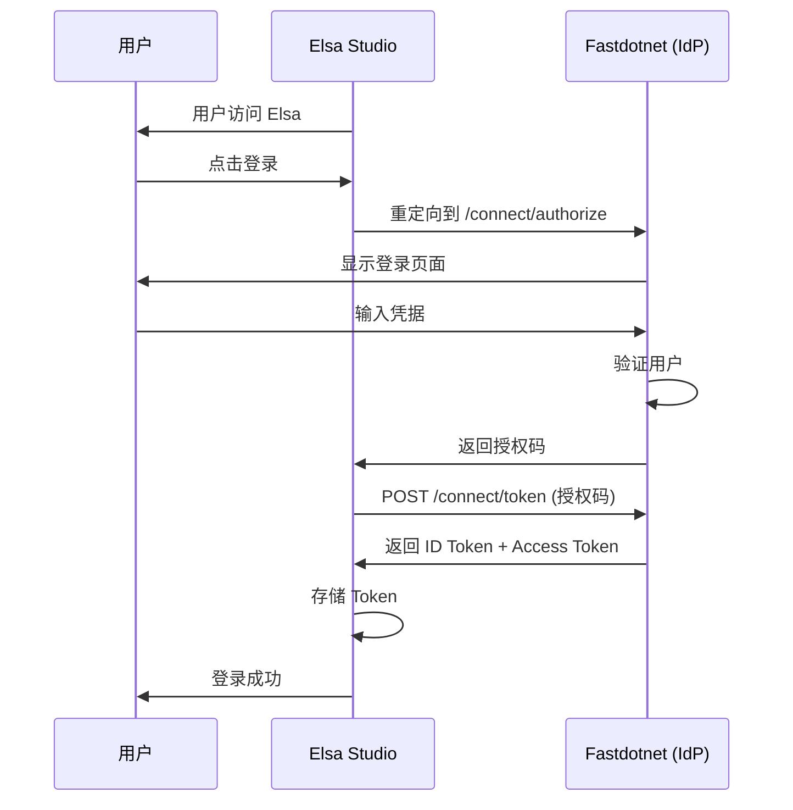

# Fastdotnet OIDC/OAuth2 Identity Provider 完整实施指南

## 📋 目录

- [概述](#概述)
- [技术栈](#技术栈)
- [功能特性](#功能特性)
- [架构设计](#架构设计)
- [快速开始](#快速开始)
- [配置详解](#配置详解)
- [API 端点](#api-端点)
- [使用示例](#使用示例)
- [安全建议](#安全建议)
- [故障排查](#故障排查)
- [下一步：Elsa 集成](#下一步elsa-集成)

---

## 概述

Fastdotnet 框架现已支持作为 **OIDC/OAuth2 Identity Provider (IdP)**，可以为外部应用（如 Elsa Workflows、第三方系统）提供统一身份认证服务。

本实现基于 **OpenIddict 7.4.0**，一个开源、轻量且完全符合标准的 OpenID Connect 和 OAuth 2.0 框架。

### 为什么选择 OpenIddict？

- ✅ **完全开源免费** - 无商业许可限制
- ✅ **标准兼容** - 完全支持 OAuth 2.0 和 OpenID Connect 规范
- ✅ **.NET 原生** - 与 ASP.NET Core 深度集成
- ✅ **灵活可扩展** - 支持多种存储后端（EF Core、MongoDB 等）
- ✅ **持续维护** - 活跃的社区和定期更新

---

## 技术栈

### 核心依赖

```xml
<!-- Directory.Packages.props -->
<PackageVersion Include="OpenIddict.AspNetCore" Version="7.4.0" />
<PackageVersion Include="OpenIddict.EntityFrameworkCore" Version="7.4.0" />
<PackageVersion Include="Microsoft.EntityFrameworkCore.Sqlite" Version="10.0.3" />
```

### 数据存储

- **主数据库**: SqlSugar（Fastdotnet 现有 ORM）
- **OIDC 数据**: Entity Framework Core + SQLite（独立存储）
  - 位置: `App_Data/oidc.db`
  - 包含: Applications, Scopes, Tokens, Authorizations

---

## 功能特性

✅ **标准 OIDC 协议支持**
- Authorization Code Flow（授权码流）
- Refresh Token Flow（刷新令牌流）
- PKCE（Proof Key for Code Exchange）支持

✅ **完整的 OIDC 端点**
- `/connect/authorize` - 授权端点
- `/connect/token` - 令牌端点
- `/connect/introspect` - 令牌内省端点
- `/connect/revoke` - 令牌撤销端点
- `/.well-known/openid-configuration` - Discovery Endpoint（自动发现）

✅ **用户信息映射**
- Subject (sub) - 用户唯一标识
- Name - 用户名
- Email - 邮箱地址
- Roles - 用户角色

✅ **默认客户端注册**
- Elsa Workflows（Client ID: `elsa-workflows`）

---

## 架构设计

### 项目结构

```
Fastdotnet/backend/
├── Fastdotnet.Core/
│   ├── Data/
│   │   └── OidcDbContext.cs              # EF Core DbContext for OIDC
│   ├── Service/Oidc/
│   │   └── OidcApplicationInitializer.cs # 自动注册 OIDC 客户端
│   └── Settings/
│       └── OidcSettings.cs               # OIDC 配置类
├── Fastdotnet.WebApi/
│   ├── Controllers/Oidc/
│   │   └── AuthorizationController.cs    # OIDC 授权控制器
│   ├── Program.cs                        # OpenIddict 配置
│   └── GlobalUsings.cs                   # 全局 using 引用
└── Directory.Packages.props              # NuGet 包版本管理
```

### 核心组件说明

#### 0. 认证配置（重要）

**文件**: `Fastdotnet.WebApi/Program.cs`

OpenIddict 的交互式端点（如授权端点）需要 Cookie 认证支持：

```csharp
// 如果 OIDC 启用，添加 Cookie 认证
if (oidcSettings.Enabled)
{
    builder.Services.AddAuthentication()
        .AddCookie("OpenIddict.Server.AspNetCore", options =>
        {
            options.Cookie.Name = ".Fastdotnet.OIDC";
            options.ExpireTimeSpan = TimeSpan.FromMinutes(60);
            options.SlidingExpiration = true;
        });
}
```

**注意**：Cookie 名称必须与 OpenIddict 使用的认证方案名称一致（`OpenIddict.Server.AspNetCore`）。

#### 1. OidcDbContext (EF Core)

**文件**: `Fastdotnet.Core/Data/OidcDbContext.cs`

```csharp
public class OidcDbContext : DbContext
{
    public OidcDbContext(DbContextOptions<OidcDbContext> options) : base(options) { }

    protected override void OnModelCreating(ModelBuilder modelBuilder)
    {
        base.OnModelCreating(modelBuilder);
        modelBuilder.UseOpenIddict(); // 自动注册 OpenIddict 实体
    }
}
```

**作用**: 使用独立的 SQLite 数据库存储 OIDC 数据，避免影响主项目的 SqlSugar 架构。

#### 2. OidcSettings (配置类)

**文件**: `Fastdotnet.Core/Settings/OidcSettings.cs`

```csharp
public class OidcSettings
{
    public bool Enabled { get; set; } = false;           // 是否启用 OIDC
    public string IssuerUri { get; set; }                // 颁发者 URI
    public string SigningKey { get; set; }               // JWT 签名密钥
    public string EncryptionKey { get; set; }            // JWT 加密密钥
    public int AccessTokenLifetime { get; set; } = 60;   // Access Token 有效期(分钟)
    public int RefreshTokenLifetime { get; set; } = 30;  // Refresh Token 有效期(天)
    public bool RequirePkce { get; set; } = true;        // 是否需要 PKCE
    public bool RequireHttpsMetadata { get; set; } = true; // 是否需要 HTTPS
}
```

#### 3. OidcApplicationInitializer (客户端注册)

**文件**: `Fastdotnet.Core/Service/Oidc/OidcApplicationInitializer.cs`

**作用**: 应用启动时自动注册 Elsa Workflows 作为 OIDC 客户端。

```csharp
private async Task RegisterElsaClientAsync()
{
    var descriptor = new OpenIddictApplicationDescriptor
    {
        ClientId = "elsa-workflows",
        ClientSecret = "elsa-secret-key-change-in-production",
        DisplayName = "Elsa Workflows",
        Permissions = { /* 授权码流、刷新令牌等权限 */ },
        RedirectUris = 
        { 
            new Uri("http://localhost:18890/signin-oidc"),
            new Uri("https://localhost:18890/signin-oidc")
        },
        Requirements = { Requirements.Features.ProofKeyForCodeExchange }
    };

    await _applicationManager.CreateAsync(descriptor);
}
```

#### 4. AuthorizationController (授权逻辑)

**文件**: `Fastdotnet.WebApi/Controllers/Oidc/AuthorizationController.cs`

**关键端点**:

- **GET/POST `/connect/authorize`** - 处理授权请求
  ```csharp
  public async Task<IActionResult> Authorize()
  {
      var request = HttpContext.GetOpenIddictServerRequest();
      
      // 如果用户未认证，返回 Challenge
      if (!User.Identity?.IsAuthenticated ?? true)
      {
          return Challenge(
              authenticationSchemes: OpenIddictServerAspNetCoreDefaults.AuthenticationScheme,
              properties: new AuthenticationProperties(...));
      }
      
      // 创建 Claims 并签署
      var claimsPrincipal = CreateClaimsPrincipal(User, request);
      return SignIn(claimsPrincipal, OpenIddictServerAspNetCoreDefaults.AuthenticationScheme);
  }
  ```

- **POST `/connect/token`** - 处理令牌请求
  ```csharp
  public async Task<IActionResult> Exchange()
  {
      var request = HttpContext.GetOpenIddictServerRequest();
      
      if (request.IsPasswordGrantType())
      {
          // 密码授权流：验证用户名密码
          var loginResult = await _authService.LoginAsync(loginDto, userCategory);
          // 创建 Claims 并返回令牌
      }
      
      if (request.IsAuthorizationCodeGrantType())
      {
          // 授权码流：验证授权码
          var result = await HttpContext.AuthenticateAsync(...);
          // 返回令牌
      }
  }
  ```

#### 5. Program.cs (OpenIddict 配置)

**关键配置**:

```csharp
// 1. 注册 DbContext
builder.Services.AddDbContext<OidcDbContext>(options =>
{
    var dbPath = Path.Combine(AppDomain.CurrentDomain.BaseDirectory, "App_Data", "oidc.db");
    options.UseSqlite($"Data Source={dbPath}");
    options.UseOpenIddict(); // 注册 OpenIddict 实体
});

// 2. 配置 OpenIddict
builder.Services.AddOpenIddict()
    .AddCore(options =>
    {
        options.UseEntityFrameworkCore().UseDbContext<OidcDbContext>();
    })
    .AddServer(options =>
    {
        // 设置端点
        options.SetAuthorizationEndpointUris("connect/authorize")
               .SetTokenEndpointUris("connect/token")
               .SetIntrospectionEndpointUris("connect/introspect")
               .SetRevocationEndpointUris("connect/revoke");

        // 允许授权码流和刷新令牌流
        options.AllowAuthorizationCodeFlow().AllowRefreshTokenFlow();

        // 注册作用域
        options.RegisterScopes(
            OpenIddictConstants.Scopes.OpenId,
            OpenIddictConstants.Scopes.Profile,
            OpenIddictConstants.Scopes.Email,
            OpenIddictConstants.Scopes.Roles);

        // 开发环境证书（生产环境应使用正式证书）
        options.AddDevelopmentEncryptionCertificate()
               .AddDevelopmentSigningCertificate();

        // ASP.NET Core 集成
        options.UseAspNetCore()
               .EnableStatusCodePagesIntegration()
               .EnableAuthorizationEndpointPassthrough()
               .EnableTokenEndpointPassthrough();
    })
    .AddValidation(options =>
    {
        options.UseLocalServer();
        options.UseAspNetCore();
    });

// 3. 注册应用初始化器
builder.Services.AddScoped<IApplicationInitializer, OidcApplicationInitializer>();
```

---

## 快速开始

### 1. 启用 OIDC Identity Provider

编辑 `appsettings.json` 或 `appsettings.Development.json`：

```json
{
  "OidcSettings": {
    "Enabled": true, // ⚠️ 设置为 true 启用
    "IssuerUri": "http://localhost:18889", // 你的 Fastdotnet 服务地址
    "SigningKey": "your-signing-key-must-be-at-least-256-bits-long", // JWT 签名密钥
    "EncryptionKey": "your-encryption-key-must-be-at-least-256-bits-long", // JWT 加密密钥（可选）
    "AccessTokenLifetime": 60, // Access Token 有效期（分钟）
    "RefreshTokenLifetime": 30, // Refresh Token 有效期（天）
    "IdTokenLifetime": 60, // ID Token 有效期（分钟）
    "AllowRefreshTokens": true,
    "RequirePkce": true, // 生产环境建议启用
    "RequireHttpsMetadata": false // 开发环境设为 false，生产环境必须设为 true
  }
}
```

### 2. 生成安全的密钥

**重要：** 生产环境必须使用强随机密钥！

```bash
# Linux/Mac
openssl rand -base64 32

# Windows PowerShell
-join ((65..90) + (97..122) + (48..57) | Get-Random -Count 32 | ForEach-Object {[char]$_})
```

示例输出：
```
aB3dEfGhIjKlMnOpQrStUvWxYz012345
```

### 3. 编译并运行

```bash
cd Fastdotnet/backend
dotnet build Fastdotnet.WebApi\Fastdotnet.WebApi.csproj
dotnet run --project Fastdotnet.WebApi\Fastdotnet.WebApi.csproj
```

启动后，控制台将显示：
```
✅ OIDC/OAuth2 Identity Provider 已启用
ℹ️ 正在注册 Elsa Workflows OIDC 客户端...
✅ Elsa OIDC 客户端注册成功
```

---

## API 端点

### 1. Discovery Endpoint (自动发现)

**URL**: `GET /.well-known/openid-configuration`

**作用**: 返回 OIDC 服务器的配置信息，客户端可以自动获取所有端点和功能。

**示例请求**:
```bash
curl http://localhost:18889/.well-known/openid-configuration
```

**示例响应**:
```json
{
  "issuer": "http://localhost:18889",
  "authorization_endpoint": "http://localhost:18889/connect/authorize",
  "token_endpoint": "http://localhost:18889/connect/token",
  "introspection_endpoint": "http://localhost:18889/connect/introspect",
  "revocation_endpoint": "http://localhost:18889/connect/revoke",
  "jwks_uri": "http://localhost:18889/.well-known/jwks",
  "scopes_supported": ["openid", "profile", "email", "roles"],
  "response_types_supported": ["code"],
  "grant_types_supported": ["authorization_code", "refresh_token"],
  "subject_types_supported": ["public"],
  "id_token_signing_alg_values_supported": ["RS256"],
  "token_endpoint_auth_methods_supported": ["client_secret_basic", "client_secret_post"]
}
```

### 2. Authorization Endpoint (授权端点)

**URL**: `GET /connect/authorize`

**作用**: 用户登录并授权客户端访问其资源。

**请求参数**:
- `client_id`: 客户端 ID
- `redirect_uri`: 重定向 URI
- `response_type`: 响应类型（`code`）
- `scope`: 请求的作用域（`openid profile email roles`）
- `state`: 随机字符串（防止 CSRF）
- `code_challenge`: PKCE 代码挑战
- `code_challenge_method`: PKCE 方法（`S256`）

**示例 URL**:
```
http://localhost:18889/connect/authorize?
  client_id=elsa-workflows&
  redirect_uri=http://localhost:18890/signin-oidc&
  response_type=code&
  scope=openid%20profile%20email%20roles&
  state=xyz123&
  code_challenge=abc456&
  code_challenge_method=S256
```

### 3. Token Endpoint (令牌端点)

**URL**: `POST /connect/token`

**作用**: 使用授权码换取 Access Token 和 ID Token。

**请求参数** (application/x-www-form-urlencoded):
- `grant_type`: `authorization_code`
- `code`: 授权码
- `redirect_uri`: 重定向 URI
- `client_id`: 客户端 ID
- `client_secret`: 客户端密钥
- `code_verifier`: PKCE 代码验证器

**示例请求**:
```bash
curl -X POST http://localhost:18889/connect/token \
  -H "Content-Type: application/x-www-form-urlencoded" \
  -d "grant_type=authorization_code" \
  -d "code=AUTH_CODE_HERE" \
  -d "redirect_uri=http://localhost:18890/signin-oidc" \
  -d "client_id=elsa-workflows" \
  -d "client_secret=elsa-secret-key-change-in-production" \
  -d "code_verifier=CODE_VERIFIER_HERE"
```

**示例响应**:
```json
{
  "access_token": "eyJhbGciOiJSUzI1NiIsInR5cCI6IkpXVCJ9...",
  "id_token": "eyJhbGciOiJSUzI1NiIsInR5cCI6IkpXVCJ9...",
  "token_type": "Bearer",
  "expires_in": 3600,
  "refresh_token": "def50200...",
  "scope": "openid profile email roles"
}
```

### 4. Introspection Endpoint (令牌内省)

**URL**: `POST /connect/introspect`

**作用**: 验证 Access Token 的有效性并获取令牌信息。

**示例请求**:
```bash
curl -X POST http://localhost:18889/connect/introspect \
  -u "resource_server:resource-server-secret" \
  -d "token=ACCESS_TOKEN_HERE"
```

**示例响应**:
```json
{
  "active": true,
  "sub": "user123",
  "client_id": "elsa-workflows",
  "scope": "openid profile email roles",
  "exp": 1234567890
}
```

### 5. Revocation Endpoint (令牌撤销)

**URL**: `POST /connect/revoke`

**作用**: 撤销 Access Token 或 Refresh Token。

**示例请求**:
```bash
curl -X POST http://localhost:18889/connect/revoke \
  -u "elsa-workflows:elsa-secret-key-change-in-production" \
  -d "token=REFRESH_TOKEN_HERE" \
  -d "token_type_hint=refresh_token"
```

---

## 验证 OIDC 配置

### 测试 Discovery Endpoint

访问以下 URL 验证 OIDC 配置是否正确：

```
http://localhost:18889/.well-known/openid-configuration
```

你应该看到类似以下的 JSON 响应：

```json
{
  "issuer": "http://localhost:18889",
  "authorization_endpoint": "http://localhost:18889/connect/authorize",
  "token_endpoint": "http://localhost:18889/connect/token",
  "logout_endpoint": "http://localhost:18889/connect/logout",
  "introspection_endpoint": "http://localhost:18889/connect/introspect",
  "revocation_endpoint": "http://localhost:18889/connect/revoke",
  "jwks_uri": "http://localhost:18889/.well-known/jwks",
  "scopes_supported": ["openid", "profile", "email", "roles"],
  "response_types_supported": ["code"],
  "grant_types_supported": ["authorization_code", "refresh_token"],
  ...
}
```

---

## 配置 Elsa Workflows 作为 OIDC Client

Elsa Studio 可以通过 OIDC 与 Fastdotnet 进行单点登录集成。

### Elsa 配置示例

在 Elsa Studio 的 `Program.cs` 或 `appsettings.json` 中配置：

```csharp
// Program.cs
builder.Services.AddOpenIdConnectAuth(options =>
{
    options.Authority = "http://localhost:18889"; // Fastdotnet 地址
    options.ClientId = "elsa-workflows";
    options.ClientSecret = "elsa-secret-key-change-in-production";
    options.AuthenticationScopes = new[] 
    { 
        "openid", 
        "profile", 
        "email", 
        "roles" 
    };
    options.UsePkce = true;
    options.SaveTokens = true;
});
```

或者在 `appsettings.json` 中：

```json
{
  "Authentication": {
    "Provider": "OpenIdConnect",
    "OpenIdConnect": {
      "Authority": "http://localhost:18889",
      "ClientId": "elsa-workflows",
      "ClientSecret": "elsa-secret-key-change-in-production",
      "Scopes": ["openid", "profile", "email", "roles"],
      "UsePkce": true,
      "SaveTokens": true
    }
  }
}
```

---

## 自定义 OIDC 客户端

如果需要注册其他应用作为 OIDC 客户端，可以修改 `OidcApplicationInitializer.cs`：

```csharp
private async Task RegisterCustomClientAsync()
{
    var descriptor = new OpenIddictApplicationDescriptor
    {
        ClientId = "your-client-id",
        ClientSecret = "your-client-secret",
        DisplayName = "Your Application Name",
        Permissions = { /* 配置权限 */ },
        RedirectUris = { new Uri("https://your-app.com/signin-oidc") },
        PostLogoutRedirectUris = { new Uri("https://your-app.com/signout-callback-oidc") }
    };

    await _applicationManager.CreateAsync(descriptor);
}
```

---

## 安全建议

### 生产环境清单

- [ ] 设置 `RequireHttpsMetadata: true`
- [ ] 使用强随机签名密钥（至少 256 位）
- [ ] 使用强随机加密密钥（如果启用加密）
- [ ] 更改所有默认客户端密钥
- [ ] 配置正确的 CORS 策略
- [ ] 启用日志记录和监控
- [ ] 定期轮换密钥
- [ ] 限制允许的 Redirect URIs

### 密钥管理

**不要**将密钥硬编码在代码中！建议使用：

1. **环境变量**
   ```bash
   export OidcSettings__SigningKey="your-secret-key"
   ```

2. **Azure Key Vault / AWS Secrets Manager**

3. **Docker Secrets**

4. **Kubernetes Secrets**

---

## 故障排查

### 问题 1：Discovery Endpoint 返回 404

**原因：** OIDC 未启用或配置错误

**解决方案：**
1. 检查 `OidcSettings.Enabled` 是否为 `true`
2. 查看应用启动日志，确认显示 "✅ OIDC/OAuth2 Identity Provider 已启用"
3. 检查数据库连接是否正常

### 问题 2：令牌验证失败

**原因：** 密钥不匹配或时钟不同步

**解决方案：**
1. 确保 Client 和 Server 使用相同的签名密钥
2. 检查服务器时间是否同步
3. 启用详细日志记录查看具体错误

### 问题 3：重定向 URI 不匹配

**原因：** 配置的 Redirect URI 与实际不符

**解决方案：**
1. 检查 `OidcApplicationInitializer` 中注册的 Redirect URIs
2. 确保 Client 配置的重定向地址完全匹配（包括端口和路径）

---

## 技术架构

### 数据持久化

OpenIddict 使用 Entity Framework Core 存储以下数据：
- 应用程序（Clients）
- 作用域（Scopes）
- 令牌（Tokens）
- 授权（Authorizations）

当前配置使用 SqlSugar 的 DbContext，与主框架共享数据库。

### 认证流程



---

## 参考资料

- [OpenIddict 官方文档](https://documentation.openiddict.com/)
- [OpenID Connect 规范](https://openid.net/specs/openid-connect-core-1_0.html)
- [OAuth 2.0 规范](https://oauth.net/2/)
- [Elsa Workflows 文档](https://v3.elsaworkflows.io/)

---

## 常见问题 (FAQ)

### Q1: 如何禁用 OIDC 功能？

将 `appsettings.json` 中的 `OidcSettings.Enabled` 设置为 `false`，然后重启应用。

### Q2: 可以自定义用户 Claims 吗？

可以！修改 `AuthorizationController.cs` 中的 `Authorize()` 方法，根据需要添加或删除 Claims。

### Q3: 支持哪些数据库？

当前使用 SQLite 存储 OIDC 数据，但可以轻松切换到 SQL Server、PostgreSQL、MySQL 等，只需修改 `Program.cs` 中的 DbContext 配置。

### Q4: 如何在生产环境使用正式证书？

替换开发环境证书：
```csharp
// 替换这两行
options.AddDevelopmentEncryptionCertificate()
       .AddDevelopmentSigningCertificate();

// 为
options.AddSigningCertificate(certificate) // X509Certificate2
       .AddEncryptionCertificate(certificate);
```

### Q5: 性能如何？

OpenIddict 7.x 性能优秀，令牌验证完全在本地进行（无需网络请求），适合高并发场景。

---

## 总结

✅ **已完成**:
- OpenIddict 7.4.0 集成
- 完整的 OIDC/OAuth2 Identity Provider 功能
- 默认注册 Elsa Workflows 客户端
- Discovery Endpoint 自动发现
- Authorization Code Flow + PKCE
- Refresh Token Flow
- 令牌内省和撤销

⚠️ **注意事项**:
- OIDC 功能默认禁用，需手动启用
- 生产环境必须使用 HTTPS
- 生产环境必须使用强随机密钥
- 建议定期轮换签名证书

🚀 **下一步**:

完成第一步后，继续执行**第二步**：配置 Elsa 插件对接 Fastdotnet OIDC。

详见：`docs/elsa-oidc-integration.md`（待创建）
